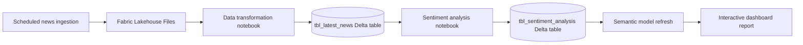
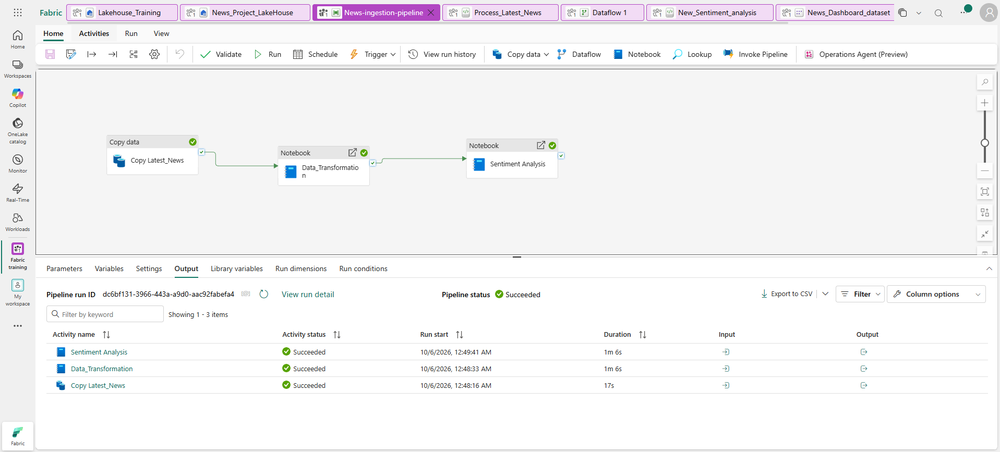

# Fabric Data Engineering: News Sentiment Analysis

An end-to-end Microsoft Fabric analytics project. A scheduled pipeline copies news data into a Lakehouse, PySpark notebooks curate and score the articles, and the resulting data feeds a semantic model and interactive report.

## Architecture

## Project Contents

| Path | Purpose |
| --- | --- |
| `notebooks/01_ingest_latest_news.py` | Fabric notebook code for parsing, cleaning, deduplicating, and upserting news articles. |
| `notebooks/02_analyze_sentiment.py` | Fabric notebook code for scoring article snippets and upserting sentiment results. |
| `data/sample_latest_news.json` | Small synthetic fixture showing the expected input shape; it is not live news data. |
| `docs/media/news-ingestion-pipeline.png` | Screenshot of a successful three-activity pipeline run. |
| `docs/media/news-dashboard-demo.mp4` | Screen recording of the dashboard experience. |

The `.py` files are notebook-cell source intended to run inside a Microsoft Fabric PySpark notebook. They are not standalone Spark applications and expect Fabric's built-in `spark` session and `display()` function.

## Data Flow

1. A scheduled Fabric pipeline copies the latest news JSON into the Lakehouse at `Files/Latest_News.json`.
2. The transformation notebook flattens article records, filters missing links/snippets, deduplicates on article link, normalizes `iso_date`, and upserts into `News_Project_LakeHouse.tbl_latest_news`.
3. The sentiment notebook analyzes each article snippet and upserts results into `News_Project_LakeHouse.tbl_sentiment_analysis`.
4. The semantic model or dataset consumes the Lakehouse output and updates the report data.
5. The report presents interactive visuals and filters for exploring article and sentiment insights.

Both tables are Fabric-generated Delta outputs. Their internal files are intentionally not checked in; the notebooks create or update them in the Lakehouse.

## Requirements

- A Microsoft Fabric workspace with a Lakehouse named `News_Project_LakeHouse` attached as the notebook's default Lakehouse.
- A Fabric PySpark notebook runtime.
- SynapseML `AnalyzeText` configured and available in the Fabric environment, including any required Azure AI Language service connection and permissions.
- A news-search JSON export matching the documented input shape. The repository includes only synthetic sample records, not a live or historical news feed.

No credentials, service keys, or workspace-specific dependency snapshots belong in this repository. Configure service access in the Fabric environment or approved secret store.

## Data Model

`tbl_latest_news` contains article title, snippet, source, links, image metadata, source date text, and normalized ISO date. `tbl_sentiment_analysis` retains those article fields and adds the sentiment returned by `AnalyzeText`.

The article link is the merge key for both Delta tables, making repeated notebook runs update existing articles instead of inserting duplicate rows.

## Dashboard Demo

The pipeline run below completed successfully, including news copy, data transformation, and sentiment analysis.

[Watch the dashboard walkthrough](docs/media/news-dashboard-demo.mp4). The report uses interactive visuals and filters to explore the refreshed news and sentiment data.

## Resume Summary

**Project:** Built a scheduled Microsoft Fabric Lakehouse analytics pipeline using PySpark, Delta Lake, and SynapseML to ingest and deduplicate news articles, enrich article snippets with sentiment, and surface refreshed data through a semantic model and interactive report.

Add measured outcomes only after running the pipeline, for example: article volume processed, duplicate rate, sentiment distribution, and end-to-end runtime. No performance or scale metrics are claimed here.

## Repository Scope

This repository covers only the `News_Project_LakeHouse` workflow. Fabric table storage internals, staging data, workspace dependencies, credentials, and unrelated notebooks are excluded. The original Lakehouse's full `Latest_News.json` is not included; use the synthetic fixture for structure and provide your own permitted input in Fabric.