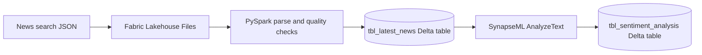

# Fabric Data Engineering: News Sentiment Analysis

An end-to-end Microsoft Fabric Lakehouse project that ingests Google News search results, cleans and deduplicates article metadata with PySpark, stores curated data as Delta tables, and enriches each article with sentiment analysis.

## Architecture

## Project Contents

| Path | Purpose |
| --- | --- |
| `notebooks/01_ingest_latest_news.py` | Fabric notebook code for parsing, cleaning, deduplicating, and upserting news articles. |
| `notebooks/02_analyze_sentiment.py` | Fabric notebook code for scoring article snippets and upserting sentiment results. |
| `data/sample_latest_news.json` | Small synthetic fixture showing the expected input shape; it is not live news data. |

The `.py` files are notebook-cell source intended to run inside a Microsoft Fabric PySpark notebook. They are not standalone Spark applications and expect Fabric's built-in `spark` session and `display()` function.

## Data Flow

1. Place the input JSON in the attached Lakehouse at `Files/Latest_News.json`. The expected shape is an object with an `organic_results` array; see the synthetic fixture in `data/`.
2. Run `notebooks/01_ingest_latest_news.py`. It flattens article records, filters missing links/snippets, deduplicates on article link, normalizes `iso_date`, and performs an idempotent Delta upsert into `News_Project_LakeHouse.tbl_latest_news`.
3. Run `notebooks/02_analyze_sentiment.py`. It analyzes each article snippet and upserts the result into `News_Project_LakeHouse.tbl_sentiment_analysis`.

Both tables are Fabric-generated Delta outputs. Their internal files are intentionally not checked in; the notebooks create or update them in the Lakehouse.

## Requirements

- A Microsoft Fabric workspace with a Lakehouse named `News_Project_LakeHouse` attached as the notebook's default Lakehouse.
- A Fabric PySpark notebook runtime.
- SynapseML `AnalyzeText` configured and available in the Fabric environment, including any required Azure AI Language service connection and permissions.
- A news-search JSON export matching the documented input shape. The repository includes only synthetic sample records, not a live or historical news feed.

No credentials, service keys, or workspace-specific dependency snapshots belong in this repository. Configure service access in the Fabric environment or approved secret store.

## Data Model

`tbl_latest_news` contains article title, snippet, source, links, image metadata, source date text, and normalized ISO date. `tbl_sentiment_analysis` retains those article fields and adds the sentiment returned by `AnalyzeText`.

The article link is the merge key for both Delta tables, making repeated notebook runs update existing articles instead of inserting duplicate rows.

## Resume Summary

**Project:** Built a Microsoft Fabric Lakehouse pipeline using PySpark and Delta Lake to ingest and deduplicate news articles, then enrich article snippets with SynapseML sentiment analysis and persist reusable analytics tables.

Add measured outcomes only after running the pipeline, for example: article volume processed, duplicate rate, sentiment distribution, and end-to-end runtime. No performance or scale metrics are claimed here.

## Repository Scope

This repository covers only the `News_Project_LakeHouse` workflow. Fabric table storage internals, staging data, workspace dependencies, credentials, and unrelated notebooks are excluded. The original Lakehouse's full `Latest_News.json` is not included; use the synthetic fixture for structure and provide your own permitted input in Fabric.